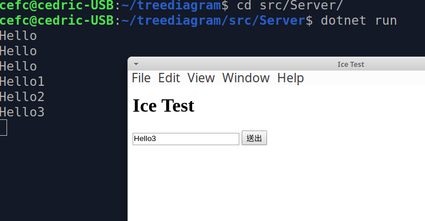

# treediagram

一個可讓客端透過API編輯樹狀圖(tree diagram)的網路服務



## Glacier2 執行

```sh
glacier2router --Ice.Config=src/glacier2.conf
```

Gui Client

```js
const Ice = require("ice").Ice;
const Glacier2 = require("ice").Glacier2;
// 設定Router
let ic = Ice.initialize([
    "--Ice.Default.Router=PublicRouter/router:tcp -h 127.0.0.1 -p 10001",
    "--Ice.RetryIntervals=-1",
    "--Ice.ACM.Client=0"
]);
let router = await Glacier2.RouterPrx.checkedCast(ic.getDefaultRouter());
// 設定帳號密碼
let session = await router.createSession("username", "password");
let proxy = ic.stringToProxy("Server:tcp -h 127.0.0.1 -p 10000");
```

[Client] <-> [Glacier2:10001] <-> [Server:10000]

## Neo4j 資料庫安裝

1. 使用 **docker** 安裝資料儲存目錄設定為`/home/cefc/Data/neo4j`
    ```sh
    sudo docker run --name neo4j -p=7474:7474 -p=7687:7687 -v=/home/cefc/Data/neo4j:/data -d neo4j
    ```
1. 使用瀏覽器登入 http://localhost:7474
1. 預設帳密 **neo4j**/**neo4j**，變更密碼為：**12369874**

## 安裝 [Slice Compiler](https://zeroc.com/downloads/ice#dotnet-core)

```sh
sudo apt-key adv --keyserver keyserver.ubuntu.com --recv B6391CB2CFBA643D
sudo apt-add-repository "deb http://zeroc.com/download/Ice/3.7/ubuntu18.04 stable main"
sudo apt-get update
sudo apt-get install zeroc-ice-compilers
```

## Server 專案

### Server分層架構

- `lib/Config`： 設定參數
- `lib/Repository`： 提供資料庫存取
- `lib/Repository/Domain`：**Repository**產生的資料或呼叫的變數型態
- `lib/Service`： 提供邏輯判斷程序
- `lib/Service/Model`：**Service**產生的資料或呼叫的變數型態
- `lib/IceBridge`：提供Ice產生Api的橋接
- `IceService.cs`：可獨立執行或嵌入`ICEbox`

### Server 專案建置

```sh
dotnet new console -o src/Server
dotnet add src/Server package zeroc.icebuilder.msbuild
dotnet add src/Server package zeroc.ice.net
dotnet add src/Server package Neo4j.Driver
# NLog
dotnet add src/Server package Microsoft.Extensions.DependencyInjection
dotnet add src/Server package NLog
dotnet add src/Server package NLog.Extensions.Logging
# Configuration
dotnet add src/Server package Microsoft.Extensions.Configuration
dotnet add src/Server package Microsoft.Extensions.Configuration.FileExtensions
dotnet add src/Server package Microsoft.Extensions.Configuration.Json
```

```xml
<?xml version="1.0" encoding="utf-8"?>
<Project Sdk="Microsoft.NET.Sdk">
    <ItemGroup>
        <SliceCompile Include="../Slice/*.ice" />
    </ItemGroup>
    <Target Name="CopyCustomContent" AfterTargets="AfterBuild">
        <!--複製NLog設定檔案-->
        <Copy SourceFiles="nlog.config" DestinationFolder="$(OutDir)" />
        <!--複製appsettings.json設定檔案-->
        <Copy SourceFiles="appsettings.json" DestinationFolder="$(OutDir)" />
    </Target>
    <Target Name="CopyCustomContentOnPublish" AfterTargets="Publish">
        <Copy SourceFiles="nlog.config" DestinationFolder="$(PublishDir)" />
        <Copy SourceFiles="appsettings.json" DestinationFolder="$(PublishDir)" />
     </Target>
</Project>
```

### Server 專案編譯

```sh
dotnet build src/Server
```

### Server 專案發布：win-x64，win-x8，linux-x64

```sh
# 輸出目錄到 src/Server/bin/Release/netcoreapp2.1/win-x64
dotnet publish --self-contained -c Release -r win-x64 src/Server
# 輸出目錄到 src/Server/bin/Release/netcoreapp2.1/win-x86
dotnet publish --self-contained -c Release -r win-x86 src/Server
# 輸出目錄到 src/Server/bin/Release/netcoreapp2.1/linux-x64
dotnet publish --self-contained -c Release -r linux-x64 src/Server
```

### Server 專案執行：

```sh
# 執行 linux-x64
cd ./src/Server/bin/Release/netcoreapp2.1/linux-x64/publish/
./Server
```

```bat
# 執行 win-x64
cd .\src\Server\bin\Release\netcoreapp2.1\win-x64/publish\
.\Server.exe
# 執行 win-x86
cd .\src\Server\bin\Release\netcoreapp2.1\win-x86/publish\
.\Server.exe
```

### Server 專案 佈署成 windows 服務：

- 使用 IceGrid + IceBox

- 使用 [nssm](http://nssm.cc/usage) （Licence：[公有領域](https://git.nssm.cc/?p=nssm.git;a=blob_plain;f=README.txt)）

```bat
nssm install treediagram_server
```


## Server.Tests 測試專案

### Server.Tests 專案建置

```sh
dotnet new mstest -o src/Server.Tests -lang C#
dotnet add src/Server.Tests reference src/Server/Server.csproj
dotnet add src/Server.Tests package Microsoft.Extensions.DependencyInjection
```

```xml
<?xml version="1.0" encoding="utf-8"?>
<Project Sdk="Microsoft.NET.Sdk">
    <Target Name="CopyCustomContent" AfterTargets="AfterBuild">
        <!--複製NLog設定檔案-->
        <Copy SourceFiles="nlog.config" DestinationFolder="$(OutDir)" />
        <!--複製appsettings.json設定檔案-->
        <Copy SourceFiles="appsettings.json" DestinationFolder="$(OutDir)" />
  </Target>
</Project>
```

### Server.Tests 專案執行：

```sh
cd src/Server.Tests
dotnet test
```

## ConsoleClient 專案

```sh
dotnet new console -o src/ConsoleClient
dotnet add src/ConsoleClient package zeroc.icebuilder.msbuild
dotnet add src/ConsoleClient package zeroc.ice.net
```

```xml
<?xml version="1.0" encoding="utf-8"?>
<Project Sdk="Microsoft.NET.Sdk">
    <ItemGroup>
        <SliceCompile Include="../Slice/*.ice" />
    </ItemGroup>
</Pro
```

### ConsoleClient 專案編譯

```sh
dotnet build src/ConsoleClient
```

## GuiClient 專案

### GuiClient 專案建置

```sh
cd ./src/GuiClient
npm init
npm install ice --save
npm install uuid --save
npm install typescript --save-dev
npm install tslint --save-dev
npm install electron --save-dev --save-exact
npm install @types/electron --save-dev
npm install @types/uuid --save-dev
# 初始化 typescript 設定
./node_modules/.bin/tsc --init
# 初始化 tslint 設定
./node_modules/.bin/tslint --init
```

### 編譯 Slice

```sh
slice2js -I./src/Slice/ --output-dir ./src/GuiClient/Ice ./src/Slice/*.ice
```

當有使用 `#include` 指令時需要增加匯入路徑

- 方法一 適用於 `electron renderer process` 環境下

    ```js
    const path = require("path");
    require('module').globalPaths.push(path.join(process.cwd(), "Ice"));
    ```
- 方法二 適用於 `nodejs` 與 `electron renderer process` 環境下

### GuiClient 專案編譯

```sh
cd ./src/GuiClient
npm run build
```

### GuiClient 專案執行：

```sh
cd ./src/GuiClient
npm run gui
```

### ice 模組在 `electron renderer process` 執行時發生的問題

由於 `./src/GuiClient/node_modules/ice/src/Ice/Timer.js` 有[非法調用](https://stackoverflow.com/questions/9677985/uncaught-typeerror-illegal-invocation-in-chrome)的問題
所以必須修改所有bind的原生函數進行修改以相容

```js
//schedule(callback, delay) { ...
const id = Timer.setTimeout(() => this.handleTimeout(token), delay);
// scheduleRepeated(callback, period) { ...
const id = Timer.setInterval(() => this.handleInterval(token), period);
//  cancel(id) { ...
if(token.isInterval)
{
    Timer.clearInterval(token.id);
}
else
{
    Timer.clearTimeout(token.id);
}
```

變成

```js
// schedule(callback, delay) {
let id
if (typeof window === "undefined") {
    id = Timer.setTimeout(() => this.handleTimeout(token), delay);
} else {
    id = Timer.setTimeout.call(window, () => this.handleTimeout(token), delay);
}
// scheduleRepeated(callback, period) {
let id
if (typeof window === "undefined") {
    id = Timer.setInterval(() => this.handleInterval(token), period);
} else {
    id = Timer.setInterval.call(window, () => this.handleInterval(token), period);
}
//  cancel(id) { ...
if (typeof window === "undefined") {
    if (token.isInterval) {
        Timer.clearInterval(token.id);
    }
    else {
        Timer.clearTimeout(token.id);
    }
} else {
    if (token.isInterval) {
        Timer.clearInterval.call(window, token.id);
    }
    else {
        Timer.clearTimeout.call(window, token.id);
    }
}
```

---

## 已知問題：

1. **Ice**框架讓Server主動推播資料到Client?

    使用 `Glacier2`

1. 複寫呼叫**Ice**產生物件的方法是非同步的，如果裡面有用到`Neo4j.Driver.V1.ISession`的`WriteTransactionAsync`的**async**方法，會導致**Block**無回應

    使用`Task.Run`+`WriteTransaction`可以運作
    ```cs
    public override string saveData(string message, Ice.Current current)
    {
        Task<string> task = Task<string>.Run(async () =>
        {
            await Task.Delay(0);
            using (var session = _driver.Session())
            {
                var result = session.WriteTransaction((tx) =>
                {
                    var result1 = tx.Run(@"
                        CREATE (a:Greeting) SET a.message = $message 
                        RETURN a.message + ', from node ' + id(a)
                    ", new { message });
                    return (result1.Single())[0].As<string>();
                });
                return result;
            }
        });
        task.Wait();
        return task.Result;
    }
    ```

    使用`Task.Run`+`WriteTransactionAsync`可以運作
    ```cs
    public override string saveData(string message, Ice.Current current)
    {
        Task<string> task = Task<string>.Run(async () =>
        {
            await Task.Delay(0);
            using (var session = _driver.Session())
            {
                var result = await session.WriteTransactionAsync(async (tx) =>
                {
                    await Task.Delay(0);
                    var result1 = await tx.RunAsync(@"
                        CREATE (a:Greeting) SET a.message = $message 
                        RETURN a.message + ', from node ' + id(a)
                    ", new { message });
                    return (await result1.SingleAsync())[0].As<string>();
                });
                return result;
            }
        });
        task.Wait();
        return task.Result;
    }
    ```
    使用`async function`+`WriteTransaction`可以運作
    ```cs
    private async Task<string> SaveDataAsync(string message)
    {
        await Task.Delay(0);
        using (var session = _driver.Session())
        {
            var result = session.WriteTransaction((tx) =>
            {
                var result1 = tx.Run(@"
                        CREATE (a:Greeting) SET a.message = $message 
                        RETURN a.message + ', from node ' + id(a)
                    ", new { message });
                return (result1.Single())[0].As<string>();
            });
            return result;
        }
    }

    public override string saveData(string message, Ice.Current current)
    {
        var task = SaveDataAsync(message);
        task.Wait();
        return task.Result;
    }
    ```

    使用`async function`+`WriteTransactionAsync`會導致**Block**無回應
    ```cs
    private async Task<string> SaveDataAsync(string message)
    {
        await Task.Delay(0);
        using (var session = _driver.Session())
        {
            // 無回應
            var result = await session.WriteTransactionAsync(async (tx) =>
                    {
                        await Task.Delay(0);
                        var result1 = await tx.RunAsync(@"
                        CREATE (a:Greeting) SET a.message = $message 
                        RETURN a.message + ', from node ' + id(a)
                    ", new { message });
                        return (await result1.SingleAsync())[0].As<string>();
                    });
            return result;
        }
    }

    public override string saveData(string message, Ice.Current current)
    {
        var task = SaveDataAsync(message);
        task.Wait();
        return task.Result;
    }
    ```