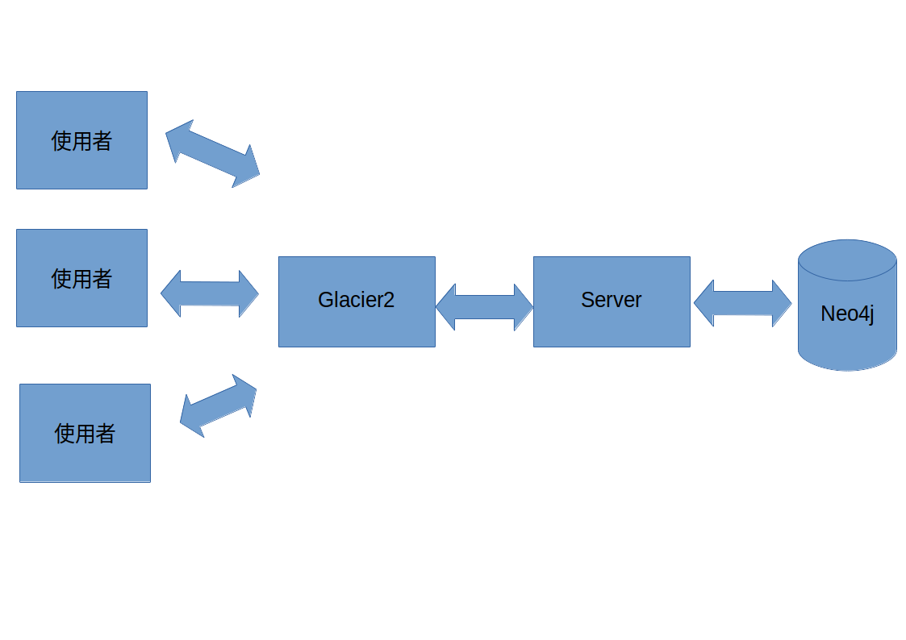

# `treediagram系統`  軟體設計文件

## 簡介

本文件主要說明「`treediagram系統`」之設計規格、目的、與範圍，
其中對系統規格、架構、流程，都有詳細的說明，
藉此讓參閱本文件的系統開發人員能迅速了解本系統的設計規格與架構。

### 規格目的

本文件的目的為說明「`treediagram系統`」之設計，
在系統進行開發時，將依循此文件來了解整個運作、設計流程，作為未來系統設計、
開發、整合、與測試時的參考，並可以減少日後維護系統時可能遇到的問題。

### 規格範圍

本文件乃定義「`treediagram系統`」之系統目標、系統範圍、
系統架構、流程、功能設計與資料庫規畫等，以作為本系統的軟體設計、研發測
試及維護之準則。

### 參考文件

- [朝陽科技大學資訊管理系-文件範例](http://www.im.cyut.edu.tw/html/project/download.htm)：[SDD](http://www.im.cyut.edu.tw/html/project/sdd.pdf)文件

- [IEEE Std 1016-1998《软件设计描述IEEE推荐实践》阅读摘要](https://blog.csdn.net/skydreamer01/article/details/2943333)

## 系統概述

本章節內容在說明「`treediagram系統`」之系統目標、系統範圍、
系統架構、軟體建構需求項目及軟體環境。

### 系統目標

### 系統範圍

在本節中將分別說明「`treediagram系統`」的相關功能與定義。

#### 系統名稱

`treediagram系統`

#### 系統功能說明

- 使用者：

### 軟體建構項目需求概述

本章節主要在說明本系統各軟體建構項目之間的功能需求、績效需求、介面需求、品質需求、及安全需求，綜合上述的考量，為使用者訂作最為人性化使用的系統。

#### 功能需求

- 使用者：

#### 介面需求

- 輸入介面：

- 輸出介面：

#### 作業程序需求

- Client 端：
- Server 端：

#### 品質需求

### 系統環境

- 軟體需求
    1. 作業系統：
    1. 開發工具：
    1. 資料庫軟體：
    1. 開發語言：
    1. 網頁製作軟體：
    1. 影像處理軟體：
- 硬體需求
    1. CPU：
    1. 硬碟：
    1. 記憶體：
    1. 網路卡：
    1. 顯示器：
    1. 鍵盤：
    1. 滑鼠：
- 網路需求
    1. 通訊環境：
    1. 連線方式：

### 設計考慮

本系統設計之主要考慮因素，列舉如下：

1. 資料的即時性：

### 系統架構

「`treediagram系統`」的系統架構如圖

## 初步設計

本章節主要在說明「`treediagram系統`」之軟體架構、系統每一軟
體組件初步設計及說明、人工作業程序、檔案/資料庫的建構描述、流程圖的運
作、資料庫的設計規劃、以及後續維護細部工作等測試、說明。

### 軟體建構項目架構

本系統的功能架構為一主從式架構服務型態(Client/Server)

### 軟體組件設計說明

1. 會員管理
    - 功能編號：1-1
    - 功能名稱：會員管理
    - 功能說明：針對 user 資料表作增刪修功能
    - 程式名稱：
    - 輸入：鍵盤、滑鼠、HOQ 資料庫、user 資料表
    - 輸出：螢幕、user 資料表
    - INPUT：點選：
        - 1-1 會員管理
        - 1-1-1 會員註冊
        - 1-1-2 會員登入
    - PROCESS：從 user 資料表讀取資料。
    - OUTPUT：依點選的項目進入所對應的畫面。
    - 資料表：user

## 流程圖

本章節針對「`treediagram系統`」之各個子功能做流程的解說以及步驟，
主要是讓使用者對系統有詳細的了解，以及日後維護方便性為主。

## 資料庫設計與規劃

本章節將針對「`treediagram系統`」中，所使用的資料庫做詳細說明，
包括資料庫中的特性、屬性內容等。

## 需求追朔

與SSR文件功能對照

### 前端系統追朔

### 後端系統追朔