# `treediagram系統`  軟體設計文件

## 簡介

本文件主要說明「`treediagram系統`」之設計規格、目的、與範圍，
其中對系統規格、架構、流程，都有詳細的說明，
藉此讓參閱本文件的系統開發人員能迅速了解本系統的設計規格與架構。

### 規格目的

本文件的目的為說明「`treediagram系統`」之設計，
在系統進行開發時，將依循此文件來了解整個運作、設計流程，作為未來系統設計、
開發、整合、與測試時的參考，並可以減少日後維護系統時可能遇到的問題。

### 規格範圍

本文件乃定義「`treediagram系統`」之系統目標、系統範圍、
系統架構、流程、功能設計與資料庫規畫等，以作為本系統的軟體設計、研發測
試及維護之準則。

### 參考文件

- [朝陽科技大學資訊管理系-文件範例](http://www.im.cyut.edu.tw/html/project/download.htm)：[SDD](http://www.im.cyut.edu.tw/html/project/sdd.pdf)文件

- [IEEE Std 1016-1998《软件设计描述IEEE推荐实践》阅读摘要](https://blog.csdn.net/skydreamer01/article/details/2943333)

## 系統概述

本章節內容在說明「`treediagram系統`」之系統目標、系統範圍、
系統架構、軟體建構需求項目及軟體環境。

### 系統目標

一個可讓客端透過API編輯樹狀圖(tree diagram)的網路服務

### 系統範圍

在本節中將分別說明「`treediagram系統`」的相關功能與定義。

#### 系統名稱

`treediagram系統`

#### 系統功能說明

- 使用者：多個客端可同時共同編輯同一樹狀圖, 修改後的結果要**即時**同步至所有編輯中的客端

### 軟體建構項目需求概述

本章節主要在說明本系統各軟體建構項目之間的功能需求、績效需求、介面需求、品質需求、及安全需求，綜合上述的考量，為使用者訂作最為人性化使用的系統。

#### 功能需求

- 使用者：

    1. 新建圖, 需選擇普通樹或二元樹
    1. 新增節點, 節點可儲存資料 (string)
    1. 編輯節點資料
    1. 刪除節點\子樹
    1. 搬移節點
    1. 檢視圖

#### 介面需求

聚焦服務設計，不要花太多時間在UI上

#### 技術要求

- 服務端使用 c# + zeroc.ice 開發, 以 Neo4j 持久化, 客端不限制。
- 使用GitHub公開專案，可即時 Code Review 並回饋。

#### 品質需求

- 自行評估所需工期。
- 請以此服務將真正在線上運作的品質來實做

### 系統環境

- 軟體需求
    1. 作業系統：Linux，Windows
    1. 開發工具：Visual Studio Code
    1. 資料庫軟體：Neo4j
    1. 開發語言：c#
    1. 中介軟體：Internet Communications Engine
- 硬體需求
    1. CPU：i5 CPU 3.50GHz 以上
    1. 硬碟：1TB
    1. 記憶體：8GB 以上
    1. 網路卡：1000Mbps 以上
    1. 顯示器：24 吋以上
    1. 鍵盤：一個
    1. 滑鼠：一個
- 網路需求
    1. 通訊環境：符合 TCP/IP、HTTP 之網路通訊協定。

### 設計考慮

本系統設計之主要考慮因素，列舉如下：

1. 資料的即時性：

多個客端可同時共同編輯同一樹狀圖, 修改後的結果要**即時**同步至所有編輯中的客端

### 系統架構

「`treediagram系統`」的系統架構如圖

## 初步設計

本章節主要在說明「`treediagram系統`」之軟體架構、系統每一軟
體組件初步設計及說明、人工作業程序、檔案/資料庫的建構描述、流程圖的運
作、資料庫的設計規劃、以及後續維護細部工作等測試、說明。

### 軟體建構項目架構

本系統的功能架構為

- 主從式架構服務(Client/Server)

    客戶端向服務端發出新增、編輯、查詢與刪除樹狀圖的指令後，由服務端處理後回報給客端。

- 事件驅動服務(Event-driven)

    透過`Glacier2`客戶端向服務端訂閱樹狀圖異動、節點異動等事件，當服務端發生異動時，主動回報給客戶端進行更新

- 系統方塊圖如下：

    

- 服務端架構圖

    

- 樹與節點管理架構圖

    

- 樹管理架構圖

    

- 節點管理架構圖

    

- 事件管理架構圖

    

### 軟體組件設計說明

1. 樹與節點管理
    1. 樹管理
        - 功能編號：1-1-1
          - 功能名稱：列出所有樹
          - 功能說明：列出所有樹
          - 程式名稱：listAllTrees
          - INPUT：無
          - PROCESS：
            1. 從樹狀圖資料讀取資料。
            1. 透過網路回傳給客端。
          - OUTPUT： 樹狀圖資料的陣列
          - 觸發事件：無
          - 資料表：樹狀圖資料
        - 功能編號：1-1-2
          - 功能名稱：新增樹
          - 功能說明：新增樹
          - 程式名稱：createTree
          - INPUT：
            1. 樹狀圖資料
          - PROCESS：
            1. 將樹狀圖資料寫入資料庫。
            1. 透過網路回傳客端處理完成。
          - OUTPUT：無
          - 觸發事件：樹狀圖清單更新發布
          - 資料表：樹狀圖資料
        - 功能編號：1-1-3
          - 功能名稱：取得樹的資料
          - 功能說明：取得樹的資料
          - 程式名稱：getTreeByUUID
          - INPUT：
            1. 樹狀圖的uuid
          - PROCESS：
            1. 利用樹狀圖的uuid查詢樹狀圖資料中的資料。
            1. 透過網路回傳給客端所取得的樹狀圖資料。
          - OUTPUT：樹狀圖資料
          - 觸發事件：無
          - 資料表：樹狀圖資料
        - 功能編號：1-1-4
          - 功能名稱：刪除樹
          - 功能說明：刪除樹
          - 程式名稱：deleteTree
          - INPUT：
            1. 樹狀圖的uuid
          - PROCESS：
            1. 利用樹狀圖的uuid查刪除樹狀圖資料中的資料。
            1. 透過網路回傳客端處理完成。
          - OUTPUT：無
          - 觸發事件：樹狀圖清單更新發布
          - 資料表：樹狀圖資料
    1. 節點管理
        - 功能編號：1-2-1
          - 功能名稱：新增節點
          - 功能說明：新增節點
          - 程式名稱：createNode
          - INPUT：
            1. 樹狀圖的uuid
            1. 父節點的uuid
            1. 節點資料
          - PROCESS：
            1. 查詢樹狀圖的類型是普通樹或二元樹
            1. 如果是普通樹直接新增節點
            1. 如果是二元樹則查詢父節點的子節點數目
            1. 如果二元樹父節點的子節點數目等於1則新增右節點
            1. 如果二元樹父節點的子節點數目等於0則新增左節點
          - OUTPUT：無
          - 觸發事件：樹狀圖資料更新發布
        - 功能編號：1-2-2
          - 功能名稱：更新節點資料
          - 功能說明：更新節點資料
          - 程式名稱：updateNodeData
          - INPUT：
            1. 節點的uuid
            1. 節點資料
          - PROCESS：
            1. 更新資料庫節點uuid為輸入值的節點資料
            1. 透過網路回傳客端處理完成。
          - OUTPUT：無
          - 觸發事件：節點資料更新發布
        - 功能編號：1-2-3
          - 功能名稱：刪除節點與其子樹
          - 功能說明：刪除節點與其子樹
          - 程式名稱：deleteNodeTree
          - INPUT：
            1. 節點的uuid
          - PROCESS：
            1. 刪除資料庫節點uuid為輸入值的節點與其子樹
            1. 透過網路回傳客端處理完成。
          - OUTPUT：無
          - 觸發事件：樹狀圖資料更新發布
        - 功能編號：1-2-4
          - 功能名稱：移動節點與子樹
          - 功能說明：移動節點與子樹
          - 程式名稱：moveNode
          - INPUT：
            1. 節點的uuid
            1. 新的父節點uuid
          - PROCESS：
            1. 查詢樹狀圖的類型是普通樹或二元樹
            1. 如果是普通樹直接移動資料庫中節點到新的父節點
            1. 如果是二元樹則查詢父節點的子節點數目
            1. 如果二元樹父節點的子節點數目等於1則移動資料庫中節點到新的父節點的右節點
            1. 如果二元樹父節點的子節點數目等於0則移動資料庫中節點到新的父節點的左節點
          - OUTPUT：無
          - 觸發事件：樹狀圖資料更新發布
        - 功能編號：1-2-5
          - 功能名稱：刪除節點保留子樹
          - 功能說明：刪除節點保留子樹
          - 程式名稱：deleteNode
          - INPUT：
            1. 節點的uuid
          - PROCESS：
            1. 查詢樹狀圖的類型是普通樹或二元樹
            1. 如果是普通樹直接刪除資料庫中該節點
            1. 如果是二元樹則查詢父節點的子節點數目與該節點子節點數目之合
            1. 如果數目之合小於等於2則移動該節點的子節點到該節點在父節點相同的位置後刪除該節點
          - OUTPUT：無
          - 觸發事件：樹狀圖資料更新發布
        - 功能編號：1-2-6
          - 功能名稱：取得所有節點資料
          - 功能說明：取得所有節點資料
          - 程式名稱：getNodeView
          - INPUT：
            1. 樹狀圖的uuid
          - PROCESS：
            1. 查詢該樹狀圖所有所有節點資料
            1. 透過網路回傳給客端。
          - OUTPUT：樹狀圖的所有節點關係
          - 觸發事件：無
1. 事件管理
    - 功能編號：2-1
      - 功能名稱：樹狀圖清單更新發布
      - 功能說明：樹狀圖清單更新發布
      - 事件名稱：TreeListUpdate
      - INPUT：無
      - PROCESS：
        1. 將訂閱清單陣列中的所有節點的回呼物件發出樹狀圖清單更新事件
      - OUTPUT：無
    - 功能編號：2-2
      - 功能名稱：樹狀圖資料更新發布
      - 功能說明：樹狀圖資料更新發布
      - 事件名稱：TreeUpdate
      - INPUT：
        1. 樹狀圖的uuid
      - PROCESS：
        1. 將訂閱清單陣列中的所有節點的回呼物件發出樹狀圖資料更新發布事件
      - OUTPUT：無
    - 功能編號：2-3
      - 功能名稱：節點資料更新發布
      - 功能說明：節點資料更新發布
      - 事件名稱：NodeUpdate
      - INPUT：
        1. 節點的uuid
        1. 節點的資料
      - PROCESS：
        1. 將訂閱清單陣列中的所有節點的回呼物件發出節點資料更新發布發布事件
      - OUTPUT：無
    - 功能編號：2-3
      - 功能名稱：登錄客端
      - 功能說明：登錄客端
      - 事件名稱：initEvent
      - INPUT：
        1. 節點的回呼物件
      - PROCESS：
        1. 將節點的回呼物件方入訂閱清單陣列中
      - OUTPUT：無

## 流程圖

本章節針對「`treediagram系統`」之各個子功能做流程解說以及步驟，主要是讓使用者對系統有詳細的了解，以及日後維護方便性為主。

- 1-1-1 列出所有樹

    

- 1-1-2 新增樹

    

- 1-1-3 取得樹的資料

    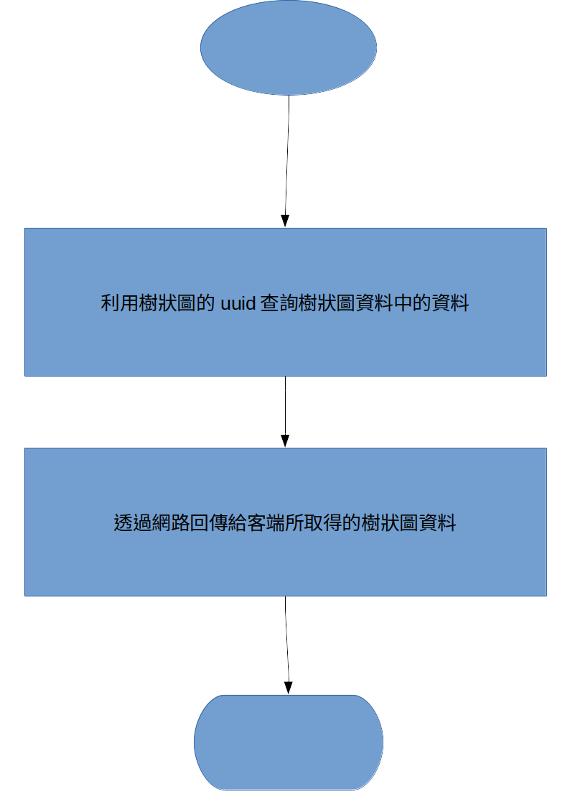

- 1-1-4 刪除樹

    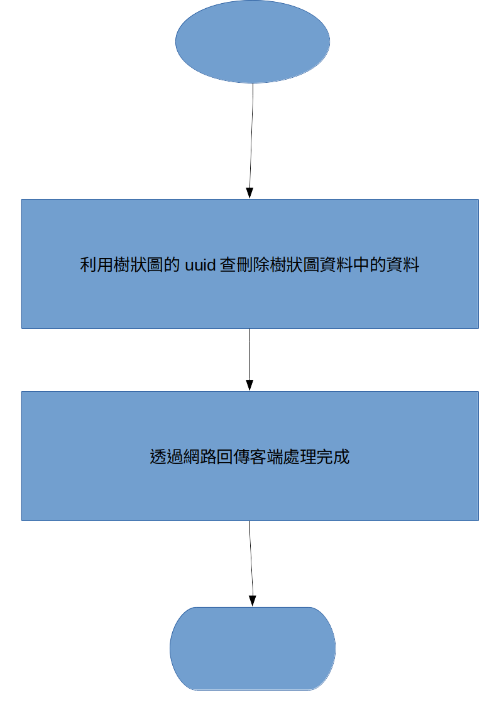

- 1-2-1 新增節點

    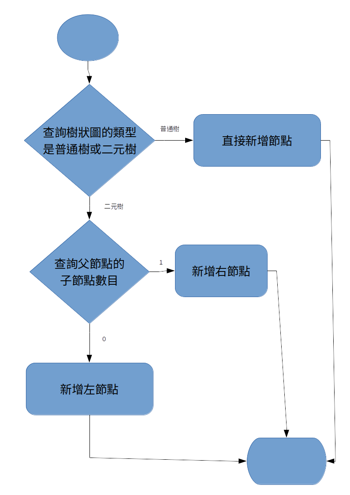

- 1-2-2 更新節點資料

    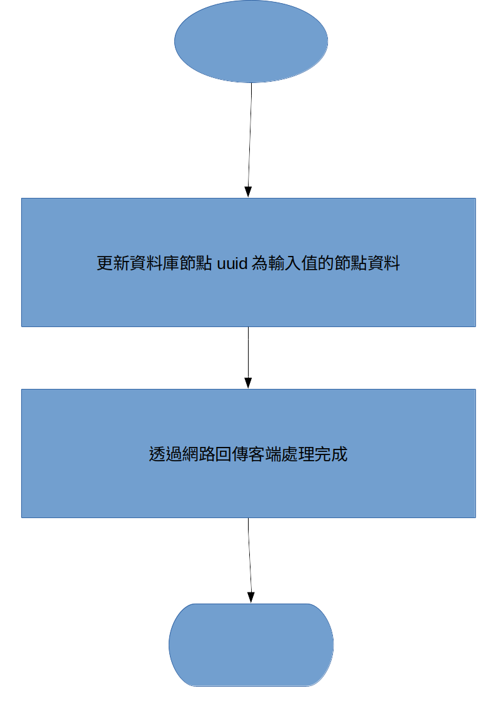

- 1-2-3 刪除節點與其子樹

    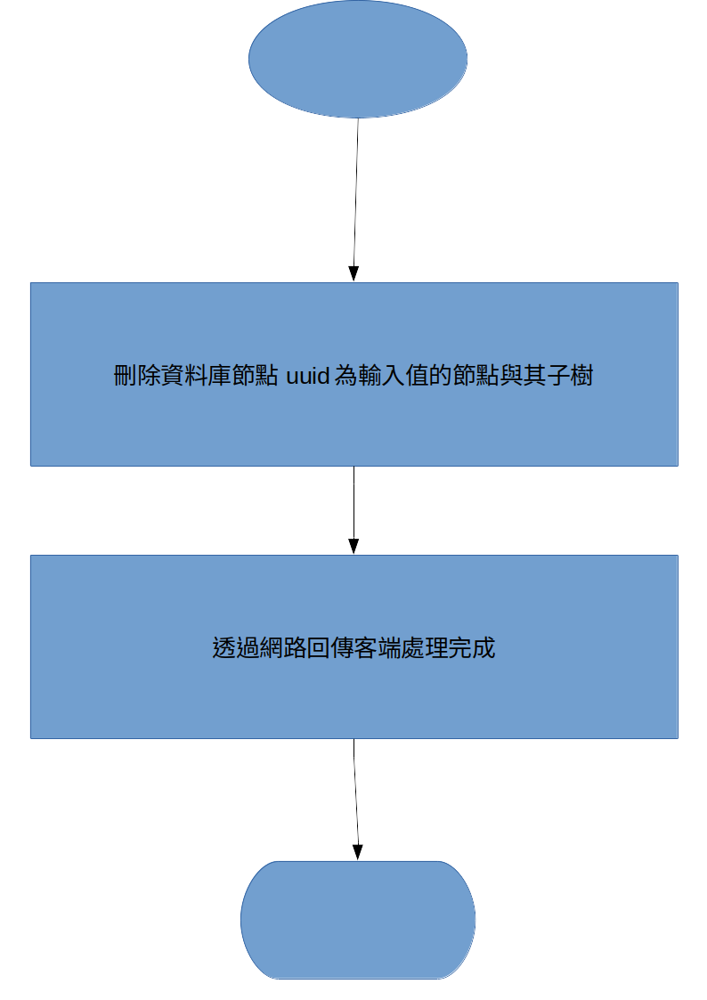

- 1-2-4 移動節點與子樹

    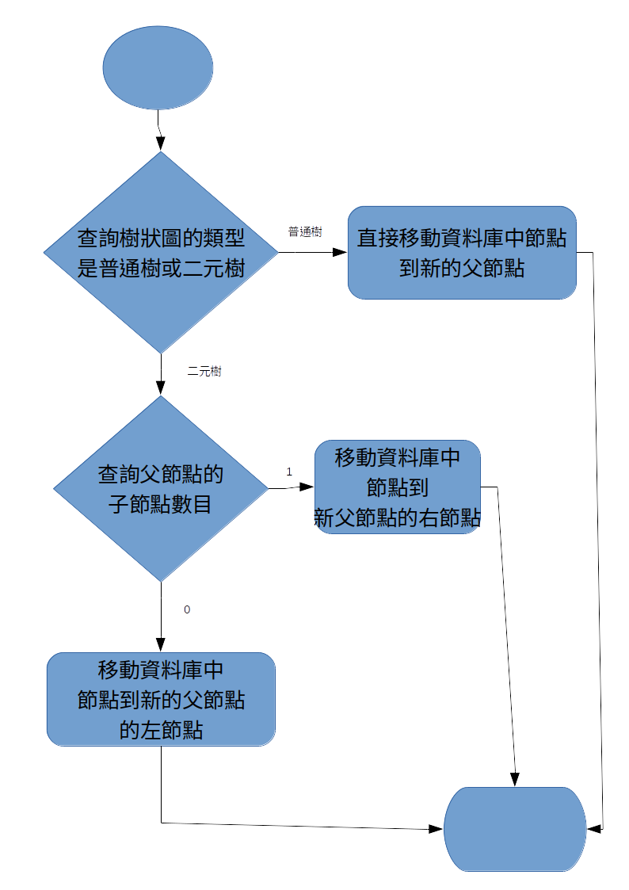

- 1-2-5 刪除節點保留子樹

    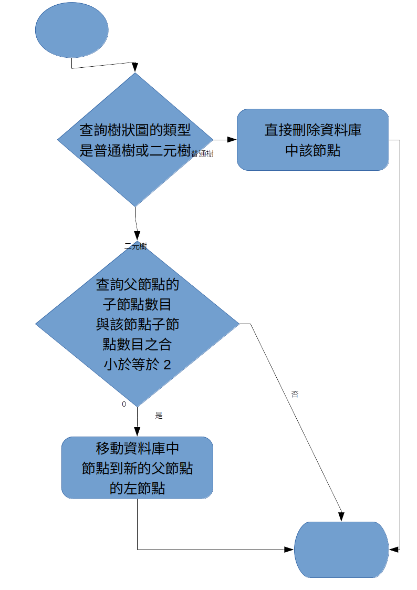

- 1-2-6 取得所有節點資料

    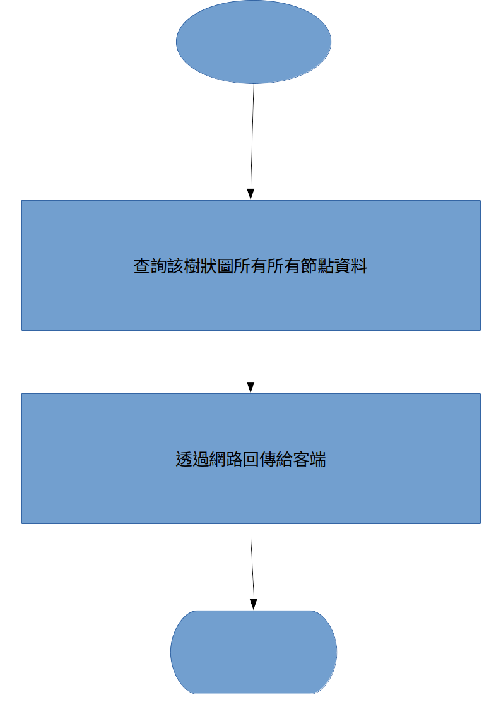

- 2-1 樹狀圖清單更新發布

    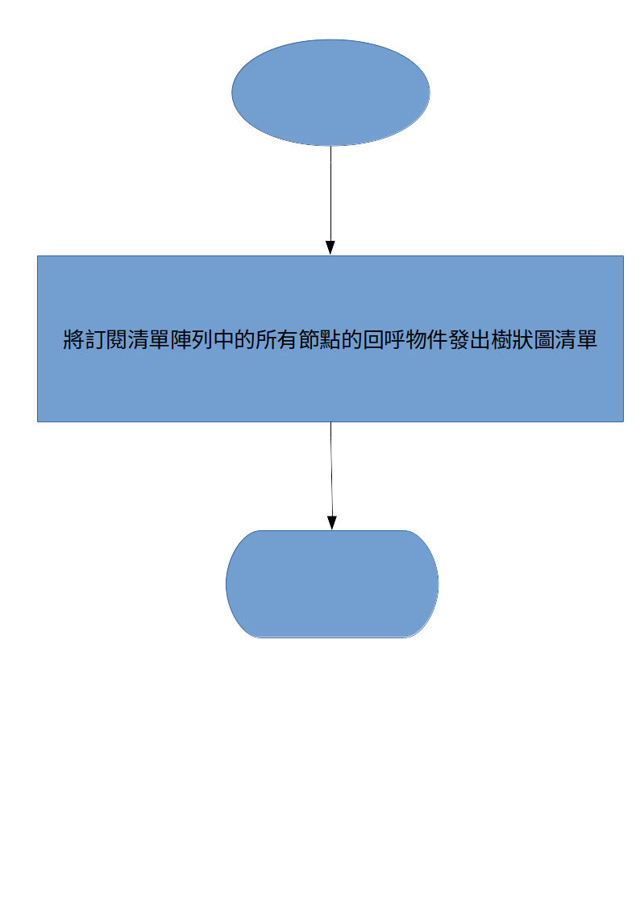

- 2-2 樹狀圖資料更新發布

    

- 2-3 節點資料更新發布

    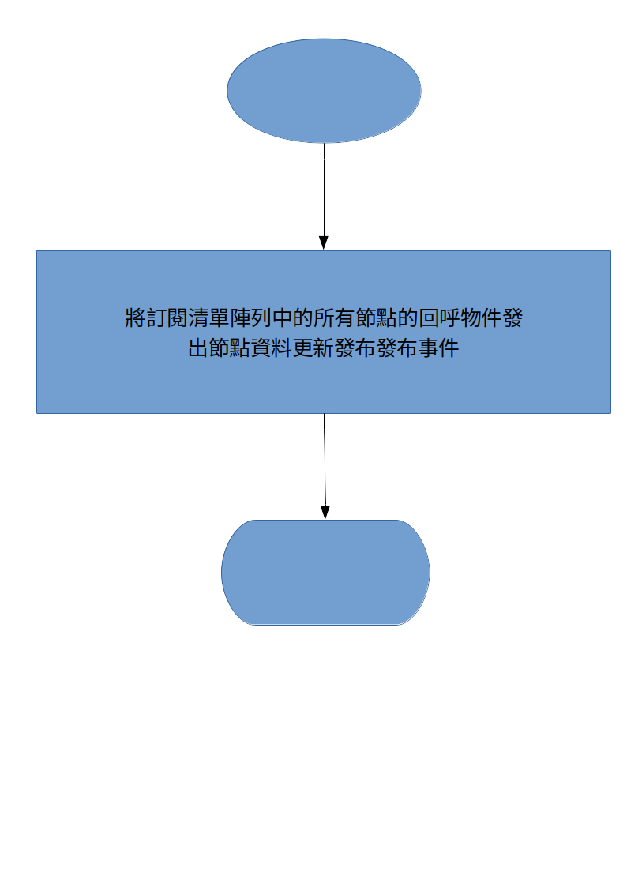

- 2-4 登錄客端

    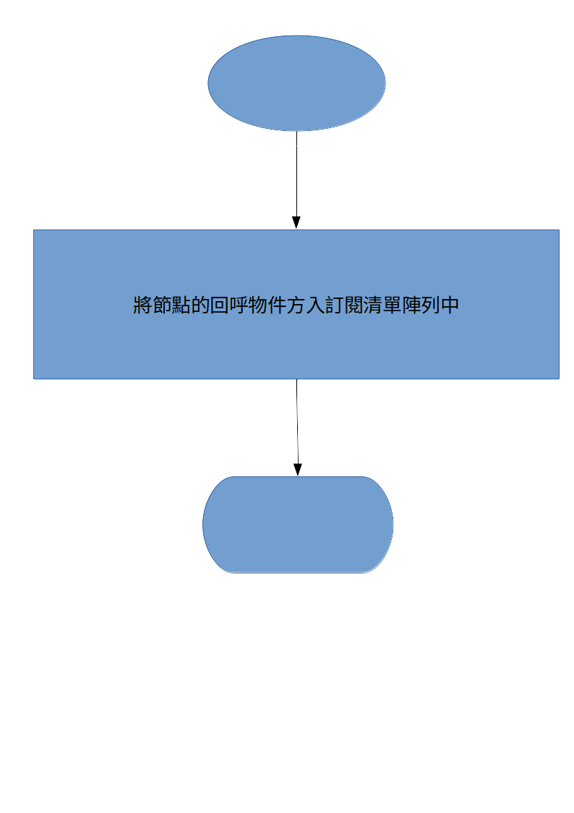

## 資料庫設計與規劃

本章節將針對「`treediagram系統`」中，所使用的資料庫做詳細說明，
包括資料庫中的特性、屬性內容等。

- Labels：
  - Tree：樹狀圖
  - Node：節點
  - IsChild：為子節點

- Nodes：
  - 名稱：樹狀圖資料
    - Label: Tree
    - properties：

      |名稱|型態|說明|
      |---|---|---|
      |uuid|字串|唯一值|
      |type|"Binary" or "Normal"|普通樹或二元樹|
      |lastUpdateDate|字串|更新時間|

  - 名稱：節點資料
    - Label: Node
    - properties：

      |名稱|型態|說明|
      |---|---|---|
      |uuid|字串|唯一值|
      |data|字串|資料|
      |root|字串|樹uuid|
      |parent|字串|父節點uuid|
      |isBinaryleft|"true" or "false"|二元樹下是否為左子樹|

- Relationships
  - 名稱：為子節點
    - Label: IsChild
    - startNode：子節點
    - endNode：父節點

## 需求追朔

|軟體功能|SDD|
|---|---|
|新建圖, 需選擇普通樹或二元樹|1-1-2|
|新增節點, 節點可儲存資料 (string)|1-2-1|
|編輯節點資料|1-2-2|
|刪除節點\子樹|1-2-3，1-2-5|
|搬移節點|1-2-4|
|檢視圖|1-2-6|
