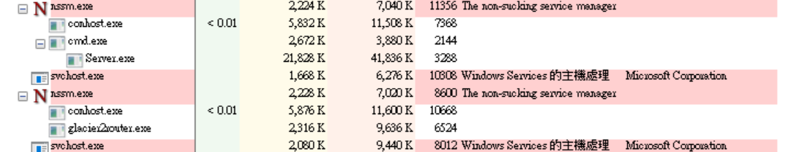
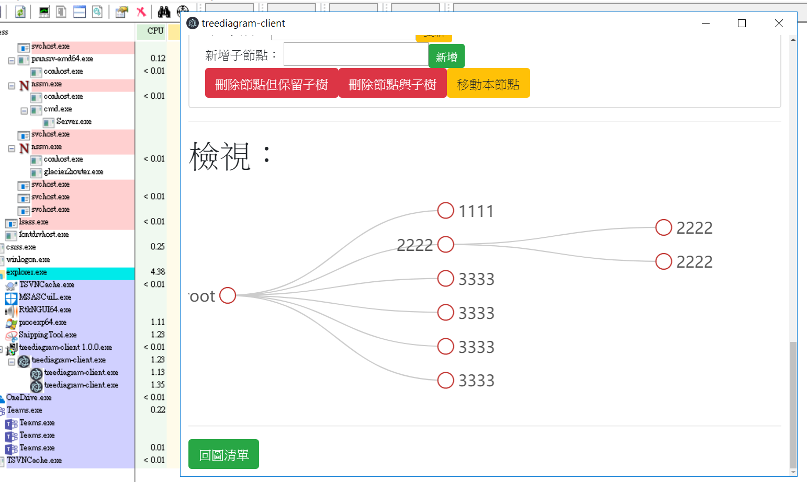

# Winsows 安裝

## neo4j 資料庫安裝

1. 安裝 `jre-8u172-windows-x64.exe`
1. 解壓縮 `neo4j-community-3.4.1-windows.zip` 到 `C:\Data\201806_treediagram\neo4j-community-3.4.1` 中
1. 以管理員模式開啟 `Windows PowerShell`執行下列指令：

    ```bat
    cd 'C:\Data\201806_treediagram\neo4j-community-3.4.1\bin'
    rem 安裝成系統服務
    .\neo4j.bat install-service
    rem 啟動服務
    .\neo4j.bat start
    rem 檢視服務
    .\neo4j.bat status
    ```

1. 使用瀏覽器登入 http://localhost:7474
1. 預設帳密 neo4j/neo4j，變更密碼為：12369874

## 安裝 Server

1. 解壓縮 `Server_win-x64_publish.7z` 到 `C:\Data\201806_treediagram\Server_win-x64_publish` 中

1. 以管理員模式開啟 `%windir%\system32\cmd.exe`執行下列指令：

    ```bat
    cd "C:\Data\201806_treediagram"
    rem 安裝成系統服務
    .\nssm.exe install 201806_treediagram C:\Data\201806_treediagram\Server_win-x64_publish.bat
    rem 啟動服務
    .\nssm.exe start 201806_treediagram
    rem 檢視服務
    .\nssm.exe status 201806_treediagram
    ```
1. 執行 `.\nssm.exe edit 201806_treediagram` 在 **Dependencies** 相依性 加入 `neo4j`

## 安裝 glacier2router

1. 以管理員模式開啟 `%windir%\system32\cmd.exe`執行下列指令：

    ```bat
    cd "C:\Data\201806_treediagram"
    rem 安裝成系統服務
    .\nssm.exe install glacier2router  "C:\Program Files\ZeroC\Ice-3.7.1\bin\glacier2router.exe" --Ice.Config="C:\Data\201806_treediagram\glacier2.conf"
    rem 啟動服務
    .\nssm.exe start glacier2router
    rem 檢視服務
    .\nssm.exe status glacier2router
    ```

## 執行 Client

執行 `treediagram-client 1.0.0.exe`

## 運行畫面



